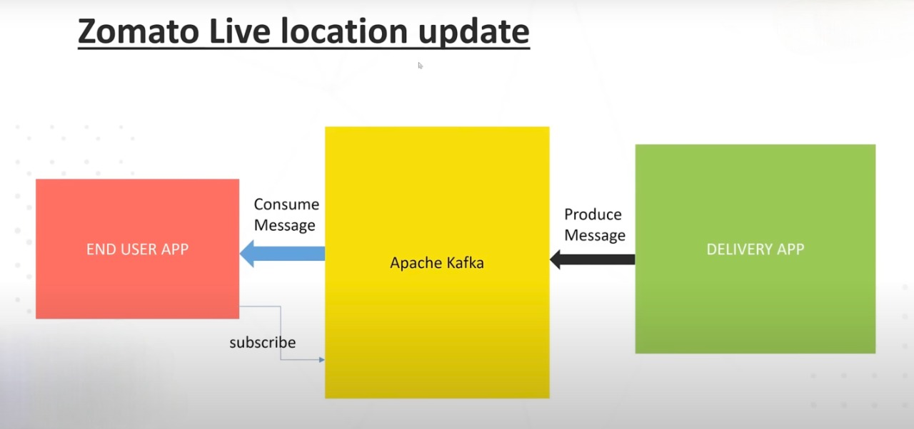

### Live-Location-with-Kafka

There are 2 microservices written in SpringBoot and Apache Kafka setup:

1. **deliveryboy** - this service produces location co-ordinates and posts them to Kafka broker
2. **enduser** -  this service subscribes for location updates to kafka broker and consumes the location co-ordinates posted by deliveryboy service

#### Dependencies (for both microservices)
- Spring Web
- Spring for Apache Kafka

#### Helpful Links
- [Spring with Apache Kafka](https://www.baeldung.com/spring-kafka)
- [Apache Kafka - documentation](https://kafka.apache.org/quickstart)
